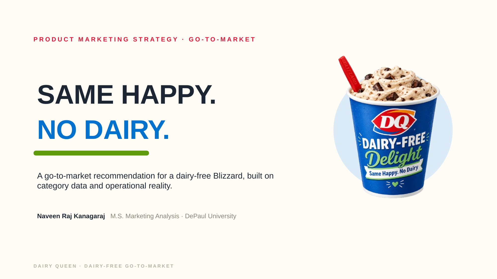
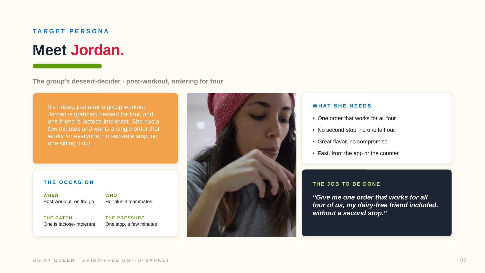
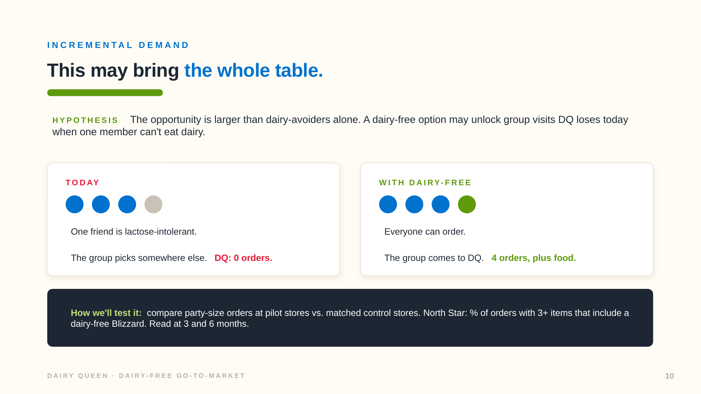
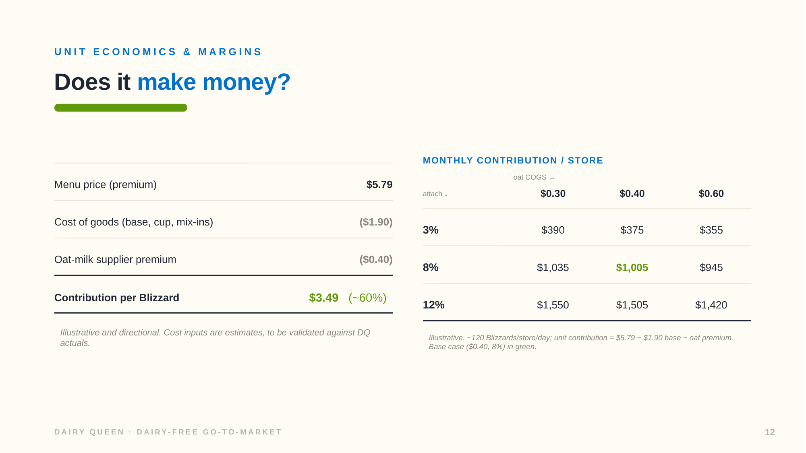
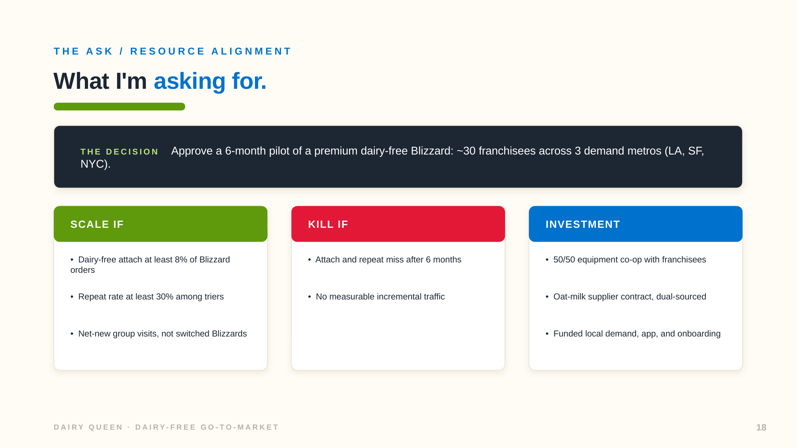

# Same Happy. No Dairy.

A go-to-market recommendation for a dairy-free Dairy Queen Blizzard, built on category data and operational reality. Product marketing case study by Naveen Raj Kanagaraj.

This is an independent case study for educational purposes. It is not affiliated with or endorsed by Dairy Queen. Brand names and marks belong to their owners. Market and category figures come from cited public research; the recommendations are my own.

[Read the full deck (PDF)](DQ-Dairy-Free-PMM.pdf)

## Background

This started as a graduate marketing-analytics team study, where I led the analytics and owned the conjoint work. I then reframed it as a product-marketing go-to-market recommendation, and in doing so I pressure-tested my own analysis and revised it. The conjoint gave directional signal, but it did not model the cost floor, the franchise structure, or the competitive map. So I rebuilt the recommendation on cited secondary data and operational reality, and treated the model as a hypothesis rather than a finding. The original team analysis lives in a companion repo: [dairy-queen-marketing-analytics](https://github.com/naveen-raj-kanagaraj/dairy-queen-marketing-analytics).

## The recommendation

Launch a dairy-free Blizzard as a **premium line extension**, not a new category, and roll it out through **opt-in franchisee recruitment in high-demand metros**, not a chain-wide mandate. Three facts drive this:

- The category is real and growing. North America is roughly a $1.25B non-dairy ice cream market in 2025, growing double digits through 2030.
- Dairy-free should be priced up, not down. Consumers will pay about 44% more for plant-based when it fits their values, every adjacent brand prices dairy-free at or above dairy, and oat milk carries a cost premium DQ has no supply chain for yet.
- DQ cannot mandate a rollout. It is roughly 100% franchised, with only two company-owned stores, so franchisees choose whether to adopt. The realistic path is a phased, demand-led pilot in metros where plant-based demand already exists.

## Selected slides

## What is inside

* The category opportunity, on cited market data
* A perceptual map showing DQ is under-differentiated, with a plain-language explainer
* The real competition: at the walk-in occasion DQ competes with QSR chains, not grocery pints, and none own dairy-free
* A persona, Jordan, the inclusive treat-seeker
* The strategic call: a Blizzard line extension, not a new category
* The real prize, framed as a hypothesis to test: a dairy-free option may unlock the group that skips DQ today when one member can't eat dairy, incremental traffic rather than switched orders
* Premium pricing driven by the oat-milk cost floor and real willingness-to-pay research
* An illustrative unit-economics business case
* A go-to-market built around the fact that DQ is almost entirely franchised
* A "what I changed, and why" slide showing the judgment behind the recommendation
* Metrics, risks, and a concrete 6-month pilot ask with scale and kill thresholds

## Sources

Category and pricing figures come from cited public research. The conjoint (n=50) and perceptual map (n=52) come from our graduate class team study, used as a directional input and consciously overridden where it conflicted with market and franchise reality.

* [Grand View Research: Dairy-Free Ice Cream Market](https://www.grandviewresearch.com/industry-analysis/dairy-free-ice-cream-market)
* [Mordor Intelligence: North America Non-Dairy Ice Cream Market](https://www.mordorintelligence.com/industry-reports/north-america-non-dairy-ice-cream-market)
* [Franchise Times: Dairy Queen (Top 400, 2025)](https://www.franchisetimes.com/top-400-2025/18-dairy-queen/article_517c78b9-34d5-4728-a9af-d4d7887fc850.html)
* [Dairy Queen statistics (Expanded Ramblings)](https://expandedramblings.com/index.php/dairy-queen-statistics-facts/)
* [Foods (2023): Willingness to Pay for Plant-Based Alternatives](https://pmc.ncbi.nlm.nih.gov/articles/PMC10048559/)
