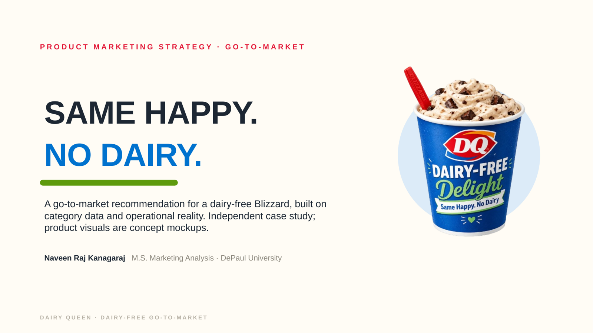
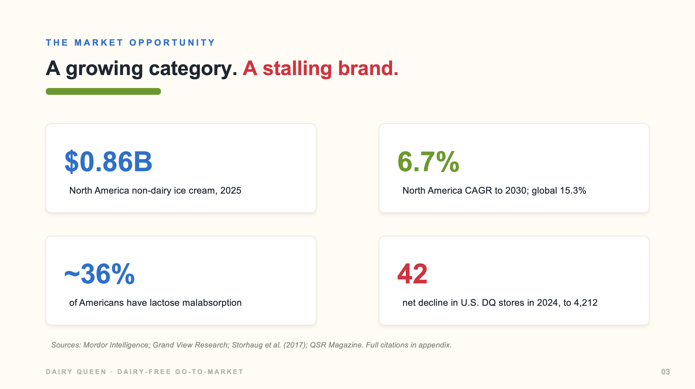
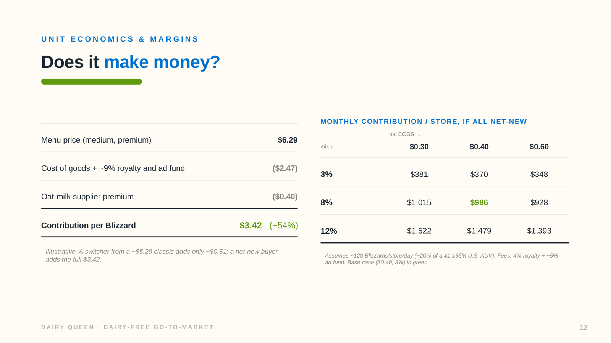
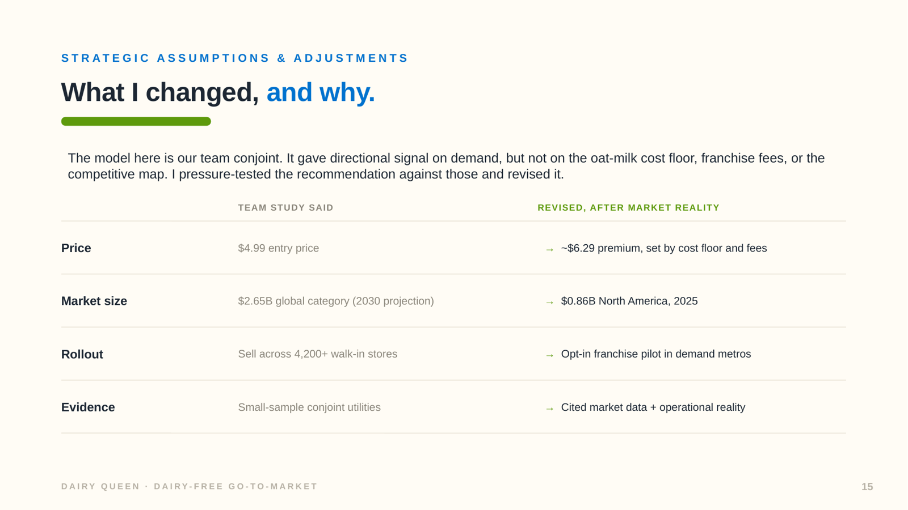

# Same Happy. No Dairy.

A product marketing recommendation on whether, and how, Dairy Queen should launch a dairy-free Blizzard, written as a decision memo for a franchise system that cannot be told what to sell.

Two stages. A five-person graduate class analytics study I led, then an independent revision that changed the price, the market sizing, and the rollout after testing them against cost, franchise, and competitive realities.

Independent case study. Not affiliated with or endorsed by Dairy Queen. Product visuals in the deck are concept mockups, unit economics are illustrative, and every external figure is cited below.

[View the full deck as PDF](DQ-Dairy-Free-PMM.pdf)

## The situation

Dairy Queen's U.S. footprint fell by 42 stores in 2024, to 4,212, with average unit volume flat at about $1.165M. Meanwhile the category it is not in keeps growing: North America non-dairy ice cream is estimated at $0.86B in 2025, rising 6.7% a year through 2030, with foodservice growing faster than retail at 7.1%.

At the QSR dessert counter, no major chain sells a dairy-free blended treat. McDonald's, Wendy's, and Culver's have none. DQ's only dairy-free item is the Non-Dairy Dilly Bar. Shake Shack added non-dairy frozen custard to its core menu in 2023 and later dropped it.

## The argument

The category is real, but the constraint is structural. Dairy Queen is nearly 100% franchised, with only two company-owned Grill & Chill stores in the U.S. Corporate cannot mandate a new SKU. Franchisees adopt it or they don't, based on equipment, training, and margin.

That makes this a recruitment problem, not a rollout problem. The recommendation is a premium line extension of the Blizzard, priced about $1 above the classic, proven through a 6-month opt-in pilot with roughly 30 franchisees in three candidate metros, with explicit scale and kill criteria.

## What the economics show

At a ~$6.29 medium, after cost of goods and about 9% in royalty and advertising fees, contribution is roughly $3.42, or 54%.

The number that decides the pilot is not that one. A customer who switches from a ~$5.29 classic adds only about $0.51. A net-new customer adds the full $3.42. So the pilot is measured on incremental group visits against matched control stores, not on trial.

## What I changed from the team study

The class conjoint (n = 50) identified $4.99 as the best-scoring price level, on an oat-milk base, sold through DQ's walk-in stores. It modeled demand and nothing else.

Three things moved once cost and franchise structure entered the picture.

**Price.** Oat milk carries a supplier premium and DQ has no supply at scale. Franchise fees take about 9% off the top. A discounted price fails the franchisee's margin test, which is the test that decides adoption. The price went up, not down, and price elasticity became the first thing the pilot tests ($0.50, $1.00, $1.50 over the classic).

**Market size.** The team study cited $2.65B at 15.3% CAGR. That is the global category, projected to 2030. The market DQ serves today is North America in 2025: $0.86B, growing 6.7%. Smaller, and honest.

**Rollout.** Chain-wide across 4,200+ stores is not something corporate can order. Shake Shack's pullback also shows that a national non-dairy launch can fail on sales. Pilot first, with kill criteria written before launch.

## Method

The recommendation rests on cited category data, DQ's published franchise economics, a three-brand retail price scan, and the team's primary research. Where the class conjoint conflicted with cost or franchise reality, I state the conflict on the slide rather than quietly dropping it.

Unit economics are illustrative and marked as such: cost inputs are estimates, and the volume assumption is ~120 Blizzards per store per day, about 20% of a $1.165M average unit volume. Blizzard prices are franchisee-set and vary by location.

The conjoint (n = 50) and perceptual map (n = 52) are small, directional class samples skewed toward urban Millennial and Gen Z consumers, and stated willingness to pay overstates real purchase behavior. In that survey, about 55% said they would pay the same or up to $1 more, which puts a ~$1 premium at the edge of stated acceptance. The deck says so.

Candidate metros (Chicago, Atlanta, Phoenix) were chosen for DQ store density. Plant-based demand in each still needs validating, and the opt-in pilot favors motivated franchisees, which matched control stores reduce but do not remove.

## My role

I led the five-person team through problem framing, survey design, analysis, and the team recommendation, and owned the quantitative core: the conjoint design, the L18 orthogonal profile set, feature-importance decomposition, part-worth utilities, and the total-preference-utility model. Stage two, the go-to-market deck and the revisions above, is my independent work.

Stage one team: Group 6, MKT 534 (Analytical Tools for Marketers), Kellstadt Graduate School of Business, DePaul University, 2026. Haydar Temirlioglu, Anirudh Siddheswaran, Natalia Salamon, Naveen Raj Kanagaraj (team lead), Elizabeth Chenier.

## Revision history

**September 2026.** Revised the market sizing from the global 2030 projection to North America 2025, added franchise royalty and advertising fees to the unit economics, separated switcher contribution from net-new contribution, replaced the pilot metros with denser DQ markets, corrected the lactose figure to lactose malabsorption prevalence, removed an unverifiable willingness-to-pay statistic, and added Shake Shack's discontinued non-dairy custard as evidence that demand must be proven rather than assumed.

**Earlier, 2026.** Class team study and first go-to-market version.

## Sources

- Mordor Intelligence, North America non-dairy ice cream market. https://www.mordorintelligence.com/industry-reports/north-america-non-dairy-ice-cream-market
- Grand View Research, dairy-free ice cream market. https://www.grandviewresearch.com/industry-analysis/dairy-free-ice-cream-market
- QSR Magazine, Dairy Queen U.S. store count, 2024 change, AUV, and company-owned stores. https://www.qsrmagazine.com/story/dairy-queen-targets-10-billion-by-2030-as-global-growth-continues/
- Entrepreneur, Dairy Queen franchise royalty and advertising fees. https://www.entrepreneur.com/franchises/directory/dairy-queen/282267
- Dairy Queen, Non-Dairy Dilly Bar. https://www.dairyqueen.com/en-us/menu/non-dairy-dilly-bar/
- Shake Shack, non-dairy frozen custard launch, 2023. https://shakeshack.com/blog/our-food/introducing-our-veggie-shack-non-dairy-chocolate-shake-and-non-dairy-frozen-custard
- Go Dairy Free, Shake Shack dairy-free menu guide (discontinuation). https://godairyfree.org/dining-out/shake-shack-dairy-free-menu
- Choices magazine (AAEA), plant-based price premiums. https://www.choicesmagazine.org/choices-magazine/submitted-articles/premiums-for-plant-based-often-about-twice-as-much-but-declining
- Storhaug et al. (2017), lactose malabsorption prevalence.

Sources accessed September 2026.

Written 2026 by Naveen Raj Kanagaraj, M.S. Marketing Analysis, DePaul University, Chicago.
